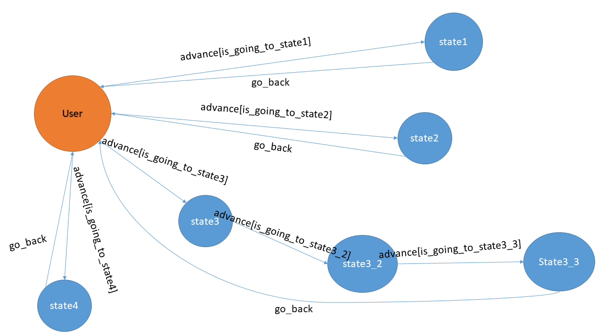

# TOC_Project
## How to Interact
### User State
* Initial state
* Enter "hello" will go to **State1**
* Enter "who are you" will go to **State2**
* Enter "你給我翻譯翻譯 什麼叫驚喜" will go to **State3**
* Enter any other string will go to **State4**
### State1
* Chat bot response "哈囉" and go back to **User State**
### State2
* Chat bot response "我是牆壁" and go back to **User State**
### State3
* Chat bot response "這還要翻譯 就是驚喜阿"
* Enter "我叫你翻譯給我聽 什麼叫驚喜" will go to **State3_2**
### State3_2
* Chat bot response "驚喜就是三天之後我給你一百八十萬兩銀子出城剿匪 接上我的腿 明白了嗎"
* Enter "這就是驚喜阿" will go to **State3_3**
### State3_3
* Chat bot response "..." and go back to **User State**
### State4
* Chat bot response "公三小" and go back to **User State**
## Finite State Machine

